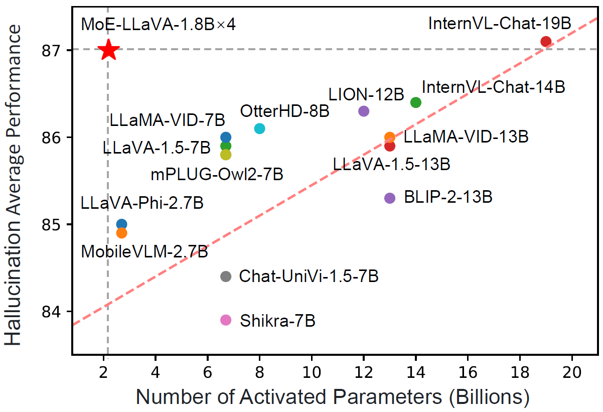
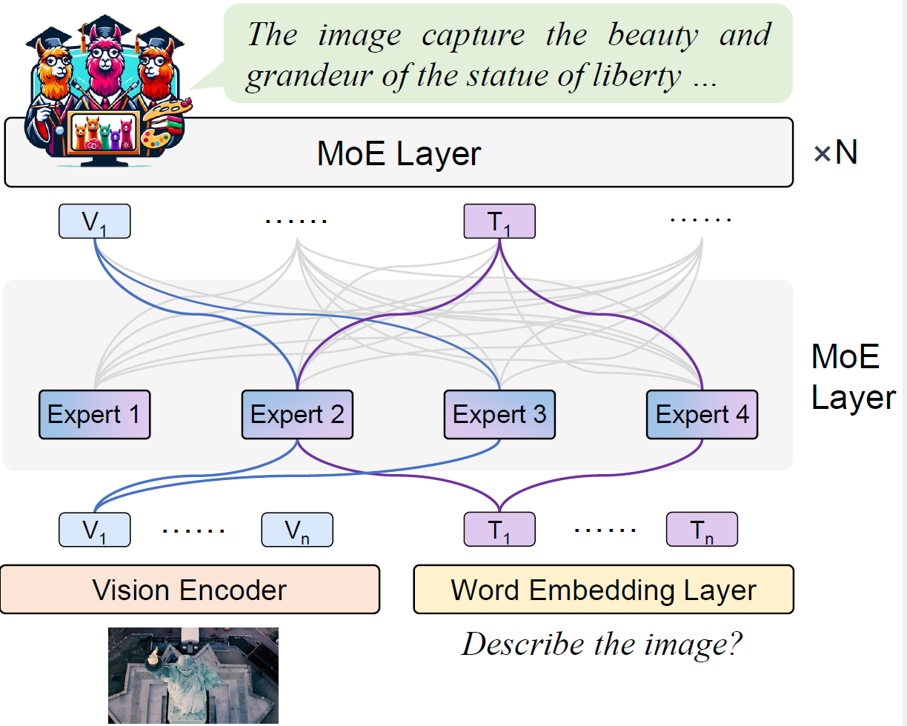

<p align="center">
    
<p>
<h2 align="center"> <a href="https://arxiv.org/abs/2401.15947">MoE-LLaVA: Mixture of Experts for Large Vision-Language Models</a></h2>
<h5 align="center"> If you like our project, please give us a star ⭐ on GitHub for latest update.  </h2>

<h5 align="center">
    


[](https://huggingface.co/spaces/LanguageBind/MoE-LLaVA)
[](https://replicate.com/camenduru/moe-llava)
[](https://colab.research.google.com/github/camenduru/MoE-LLaVA-jupyter/blob/main/MoE_LLaVA_jupyter.ipynb)
[](https://huggingface.co/papers/2401.15947)
[](https://arxiv.org/abs/2401.15947) 
[](https://www.youtube.com/watch?v=uYb38g-weEY)
[](https://mp.weixin.qq.com/s/ICylR6n2LhqQRS0CAHFI1A)
[](https://github.com/PKU-YuanGroup/MoE-LLaVA/blob/main/LICENSE) 
[](https://hits.seeyoufarm.com)
[](https://github.com/PKU-YuanGroup/MoE-LLaVA/issues?q=is%3Aopen+is%3Aissue)
[](https://github.com/PKU-YuanGroup/MoE-LLaVA/issues?q=is%3Aissue+is%3Aclosed)  <br>
</h5>

<details open><summary>💡 I also have other vision-language projects that may interest you ✨. </summary><p>
<!--  may -->

> [**Open-Sora-Plan**](https://github.com/PKU-YuanGroup/Open-Sora-Plan) <br>
[](https://github.com/PKU-YuanGroup/Open-Sora-Plan)  [](https://github.com/PKU-YuanGroup/Open-Sora-Plan) <br>

> [**Video-LLaVA: Learning United Visual Representation by Alignment Before Projection**](https://arxiv.org/abs/2311.10122) <br>
> Bin Lin, Yang Ye, Bin Zhu, Jiaxi Cui, Munan Ning, Peng Jin, Li Yuan <br>
[](https://github.com/PKU-YuanGroup/Video-LLaVA)  [](https://github.com/PKU-YuanGroup/Video-LLaVA) [](https://arxiv.org/abs/2311.10122) <br>

> [**LanguageBind: Extending Video-Language Pretraining to N-modality by Language-based Semantic Alignment**](https://arxiv.org/abs/2310.01852) <br>
> Bin Zhu, Bin Lin, Munan Ning, Yang Yan, Jiaxi Cui, HongFa Wang, Yatian Pang, Wenhao Jiang, Junwu Zhang, Zongwei Li, Wancai Zhang, Zhifeng Li, Wei Liu, Li Yuan <br>
[](https://github.com/PKU-YuanGroup/LanguageBind)  [](https://github.com/PKU-YuanGroup/LanguageBind)  [](https://arxiv.org/abs/2310.01852) <br>

</p></details>


## 📣 News
* ⏳⏳⏳ Training a stronger model under a higher image resolution (e.g 768 × 768).

* ⏳⏳⏳ Training MoE-LLaVA-Qwen1.5 to support Chinese better.
* **[2024.03.16]**  🎉 We release all stage2 models, cheching our [model zoo](#-model-zoo).
* **[2024.02.03]**  🎉 We release a stronger [MoE-LLaVA-StableLM](https://huggingface.co/LanguageBind/MoE-LLaVA-StableLM-1.8B-4e-384). The average performance is close to LLaVA-1.5-7B by using **2.0B** sparse activated parameters, checking our [model zoo](#-model-zoo).
* **[2024.02.02]**  🤝 Enjoying the [](https://replicate.com/camenduru/moe-llava) and [](https://colab.research.google.com/github/camenduru/MoE-LLaVA-jupyter/blob/main/MoE_LLaVA_jupyter.ipynb), created by [@camenduru](https://github.com/camenduru), who generously supports our research!
* **[2024.02.01]**  🔥 People who cannot access HF can now download the model through the  model scope, checking our [model zoo](#-model-zoo).
* **[2024.01.30]**  🔥 We release a stronger [MoE-LLaVA-Phi2](https://huggingface.co/LanguageBind/MoE-LLaVA-Phi2-2.7B-4e-384). The average performance **surpasses LLaVA-1.5-7B by using 3.6B** sparse activated parameters, checking our [model zoo](#-model-zoo).
* **[2024.01.27]**  🤗 [Hugging Face demo](https://huggingface.co/spaces/LanguageBind/MoE-LLaVA) and **all codes & datasets** are available now! Welcome to **watch** 👀 this repository for the latest updates.

## 😮 Highlights

MoE-LLaVA shows excellent performance in multi-modal learning.

### 🔥 High performance, but with fewer parameters
- with just **3B sparsely activated parameters**, MoE-LLaVA demonstrates performance comparable to the LLaVA-1.5-7B on various visual understanding datasets and even surpasses the LLaVA-1.5-13B in object hallucination benchmarks.

<p align="center">

</p>

### 🚀 Simple baseline, learning multi-modal interactions with sparse pathways.
- With the addition of **a simple MoE tuning stage**, we can complete the training of MoE-LLaVA on **8 A100 GPUs** within 1 days.

<p align="center">

</p>

## 🤗 Demo

### Gradio Web UI  <a href='https://github.com/gradio-app/gradio'></a> 

Highly recommend trying out our web demo by the following command, which incorporates all features currently supported by MoE-LLaVA. We also provide [online demo](https://huggingface.co/spaces/LanguageBind/MoE-LLaVA) in Huggingface Spaces.
```bash
# use phi2
deepspeed --include localhost:0 moellava/serve/gradio_web_server.py --model-path "LanguageBind/MoE-LLaVA-Phi2-2.7B-4e" 
# use qwen
deepspeed --include localhost:0 moellava/serve/gradio_web_server.py --model-path "LanguageBind/MoE-LLaVA-Qwen-1.8B-4e" 
# use stablelm
deepspeed --include localhost:0 moellava/serve/gradio_web_server.py --model-path "LanguageBind/MoE-LLaVA-StableLM-1.6B-4e" 
```


https://github.com/PKU-YuanGroup/MoE-LLaVA/assets/62638829/8541aac6-9ef6-4fde-aa94-80d0375b9bdb


### CLI Inference

```bash
# use phi2
deepspeed --include localhost:0 moellava/serve/cli.py --model-path "LanguageBind/MoE-LLaVA-Phi2-2.7B-4e"  --image-file "image.jpg"
# use qwen
deepspeed --include localhost:0 moellava/serve/cli.py --model-path "LanguageBind/MoE-LLaVA-Qwen-1.8B-4e"  --image-file "image.jpg"
# use stablelm
deepspeed --include localhost:0 moellava/serve/cli.py --model-path "LanguageBind/MoE-LLaVA-StableLM-1.6B-4e"  --image-file "image.jpg"
```


## 🐳 Model Zoo

| Model | Activated Param | Transformers(HF) | ModelScope(HF) | Avg | VQAv2 | GQA | VizWiz | SQA-IMG | T-VQA | POPE | MME | MM-Bench | MM-Vet |
|----------|-----------|-----------|---|---|---|---|---|---|---|---|---|---|---|
| MoE-LLaVA-1.6B×4-Top2 | 2.0B | [🤗LanguageBind/MoE-LLaVA-StableLM-1.6B-4e](https://huggingface.co/LanguageBind/MoE-LLaVA-StableLM-1.6B-4e) | [PKU-YuanLab/MoE-LLaVA-StableLM-1.6B-4e](https://modelscope.cn/models/PKU-YuanLab/MoE-LLaVA-StableLM-1.6B-4e) | 57.3 | 76.7 | 60.3 | 36.2 | 62.6 | 50.1 | 85.7 | 1318.1 | 60.2 | 26.9 |
| MoE-LLaVA-1.8B×4-Top2 | 2.2B | [🤗LanguageBind/MoE-LLaVA-Qwen-1.8B-4e](https://huggingface.co/LanguageBind/MoE-LLaVA-Qwen-1.8B-4e) | [PKU-YuanLab/MoE-LLaVA-Qwen-1.8B-4e](https://modelscope.cn/models/PKU-YuanLab/MoE-LLaVA-Qwen-1.8B-4e) | 56.7 | 76.2 | 61.5 | 32.6 | 63.1 | 48.0 | 87.0 | 1291.6 | 59.6 | 25.3 |
| MoE-LLaVA-2.7B×4-Top2 | 3.6B | [🤗LanguageBind/MoE-LLaVA-Phi2-2.7B-4e](https://huggingface.co/LanguageBind/MoE-LLaVA-Phi2-2.7B-4e) | [PKU-YuanLab/MoE-LLaVA-Phi2-2.7B-4e](https://modelscope.cn/models/PKU-YuanLab/MoE-LLaVA-Phi2-2.7B-4e) | 61.1 | 77.6 | 61.4 | 43.9 | 68.5 | 51.4 | 86.3 | 1423.0 | 65.2 | 34.3 |
| MoE-LLaVA-1.6B×4-Top2-384 | 2.0B | [🤗LanguageBind/MoE-LLaVA-StableLM-1.6B-4e-384](https://huggingface.co/LanguageBind/MoE-LLaVA-StableLM-1.6B-4e-384) | [PKU-YuanLab/MoE-LLaVA-StableLM-1.6B-4e-384](https://modelscope.cn/models/PKU-YuanLab/MoE-LLaVA-StableLM-1.6B-4e-384) | 60.0 | 78.6 | 61.5 | 40.5 | 63.9 | 54.3 | 85.9 | 1335.7 | 63.3 | 32.3 |
| MoE-LLaVA-2.7B×4-Top2-384 | 3.6B | [🤗LanguageBind/MoE-LLaVA-Phi2-2.7B-4e-384](https://huggingface.co/LanguageBind/MoE-LLaVA-Phi2-2.7B-4e-384) | [PKU-YuanLab/MoE-LLaVA-Phi2-2.7B-4e-384](https://modelscope.cn/models/PKU-YuanLab/MoE-LLaVA-Phi2-2.7B-4e-384) | **62.9** | 79.9 | 62.6 | 43.7 | 70.3 | 57.0 | 85.7 | 1431.3 | 68.0 | 35.9 |
| LLaVA-1.5 | 7B | [🤗liuhaotian/llava-v1.5-7b](https://huggingface.co/liuhaotian/llava-v1.5-7b) | - | 62.0 | 78.5 | 62.0 | 50.0 | 66.8 | 58.2 | 85.9 | 1510.7 | 64.3 | 30.5 |

<!--
| LLaVA-1.5 | 13B | [liuhaotian/llava-v1.5-13b](https://huggingface.co/liuhaotian/llava-v1.5-13b) | 64.9 | 80.0 | 63.3 | 53.6 | 71.6 | 61.3 | 85.9 | 1531.3 | 67.7 | 35.4 |
-->

<details>


🚨 **Please know https://github.com/PKU-YuanGroup/MoE-LLaVA/issues/27.**


<summary>Stage2 Model</summary>


    
| Model  | Checkpoint |
|----------|-----------|
| MoE-LLaVA-1.6B×4-Top2 | [LanguageBind/MoE-LLaVA-StableLM-Stage2](https://huggingface.co/LanguageBind/MoE-LLaVA-StableLM-Stage2) |
| MoE-LLaVA-1.6B×4-Top2-384 | [LanguageBind/MoE-LLaVA-StableLM-Stage2-384](https://huggingface.co/LanguageBind/MoE-LLaVA-StableLM-Stage2-384) |
| MoE-LLaVA-1.8B×4-Top2 | [LanguageBind/MoE-LLaVA-Qwen-Stage2](https://huggingface.co/LanguageBind/MoE-LLaVA-Qwen-Stage2) |
| MoE-LLaVA-2.7B×4-Top2 | [LanguageBind/MoE-LLaVA-Phi2-Stage2](https://huggingface.co/LanguageBind/MoE-LLaVA-Phi2-Stage2) |
| MoE-LLaVA-2.7B×4-Top2-384 | [LanguageBind/MoE-LLaVA-Phi2-Stage2-384](https://huggingface.co/LanguageBind/MoE-LLaVA-Phi2-Stage2-384) |

</details>

<details>
<summary>Pretrain Model</summary>

| Model  | Checkpoint |
|----------|-----------|
| MoE-LLaVA-1.6B×4-Top2 | [LanguageBind/MoE-LLaVA-StableLM-Pretrain](https://huggingface.co/LanguageBind/MoE-LLaVA-StableLM-Pretrain) |
| MoE-LLaVA-1.6B×4-Top2-384 | [LanguageBind/MoE-LLaVA-StableLM-384-Pretrain](https://huggingface.co/LanguageBind/MoE-LLaVA-StableLM-384-Pretrain) |
| MoE-LLaVA-1.8B×4-Top2 | [LanguageBind/MoE-LLaVA-Qwen-Pretrain](https://huggingface.co/LanguageBind/MoE-LLaVA-Qwen-Pretrain) |
| MoE-LLaVA-2.7B×4-Top2 | [LanguageBind/MoE-LLaVA-Phi2-Pretrain](https://huggingface.co/LanguageBind/MoE-LLaVA-Phi2-Pretrain) |
| MoE-LLaVA-2.7B×4-Top2-384 | [LanguageBind/MoE-LLaVA-Phi2-384-Pretrain](https://huggingface.co/LanguageBind/MoE-LLaVA-Phi2-384-Pretrain) |


</details>

## ⚙️ Requirements and Installation
We recommend the requirements as follows.
* Python == 3.10
* Pytorch == 2.0.1
* CUDA Version >= 11.7
* **Transformers == 4.37.0**
* **Tokenizers==0.15.1**
* Install required packages:
```bash
git clone https://github.com/PKU-YuanGroup/MoE-LLaVA
cd MoE-LLaVA
conda create -n moellava python=3.10 -y
conda activate moellava
pip install --upgrade pip  # enable PEP 660 support
pip install -e .
pip install -e ".[train]"
pip install flash-attn --no-build-isolation

# Below are optional. For Qwen model.
git clone https://github.com/Dao-AILab/flash-attention
cd flash-attention && pip install .
# Below are optional. Installing them might be slow.
# pip install csrc/layer_norm
# If the version of flash-attn is higher than 2.1.1, the following is not needed.
# pip install csrc/rotary
```

> [!Warning]
> <div align="left">
> <b>
> 🚨 We find that using flash attention2 makes performance degradation.
> </b>
> </div>

## 🗝️ Training & Validating
The training & validating instruction is in [TRAIN.md](docs/TRAIN.md) & [EVAL.md](docs/EVAL.md).

## 💡 Customizing your MoE-LLaVA
The instruction is in [CUSTOM.md](docs/CUSTOM.md).

## 😍 Visualization
The instruction is in [VISUALIZATION.md](docs/VISUALIZATION.md).

## 🤖 API
**We open source all codes.** If you want to load the model (e.g. ```LanguageBind/MoE-LLaVA-Phi2-2.7B-4e```) on local, you can use the following code snippets.

**Using the following command to run the code.**

```bash
deepspeed --include localhost:0 predict.py
```

```python
import torch
from PIL import Image
from moellava.constants import IMAGE_TOKEN_INDEX, DEFAULT_IMAGE_TOKEN
from moellava.conversation import conv_templates, SeparatorStyle
from moellava.model.builder import load_pretrained_model
from moellava.utils import disable_torch_init
from moellava.mm_utils import tokenizer_image_token, get_model_name_from_path, KeywordsStoppingCriteria

def main():
    disable_torch_init()
    image = 'moellava/serve/examples/extreme_ironing.jpg'
    inp = 'What is unusual about this image?'
    model_path = 'LanguageBind/MoE-LLaVA-Phi2-2.7B-4e'  # LanguageBind/MoE-LLaVA-Qwen-1.8B-4e or LanguageBind/MoE-LLaVA-StableLM-1.6B-4e
    device = 'cuda'
    load_4bit, load_8bit = False, False  # FIXME: Deepspeed support 4bit or 8bit?
    model_name = get_model_name_from_path(model_path)
    tokenizer, model, processor, context_len = load_pretrained_model(model_path, None, model_name, load_8bit, load_4bit, device=device)
    image_processor = processor['image']
    conv_mode = "phi"  # qwen or stablelm
    conv = conv_templates[conv_mode].copy()
    roles = conv.roles
    image_tensor = image_processor.preprocess(Image.open(image).convert('RGB'), return_tensors='pt')['pixel_values'].to(model.device, dtype=torch.float16)

    print(f"{roles[1]}: {inp}")
    inp = DEFAULT_IMAGE_TOKEN + '\n' + inp
    conv.append_message(conv.roles[0], inp)
    conv.append_message(conv.roles[1], None)
    prompt = conv.get_prompt()
    input_ids = tokenizer_image_token(prompt, tokenizer, IMAGE_TOKEN_INDEX, return_tensors='pt').unsqueeze(0).cuda()
    stop_str = conv.sep if conv.sep_style != SeparatorStyle.TWO else conv.sep2
    keywords = [stop_str]
    stopping_criteria = KeywordsStoppingCriteria(keywords, tokenizer, input_ids)

    with torch.inference_mode():
        output_ids = model.generate(
            input_ids,
            images=image_tensor,
            do_sample=True,
            temperature=0.2,
            max_new_tokens=1024,
            use_cache=True,
            stopping_criteria=[stopping_criteria])

    outputs = tokenizer.decode(output_ids[0, input_ids.shape[1]:], skip_special_tokens=True).strip()
    print(outputs)

if __name__ == '__main__':
    main()
```

## 🙌 Related Projects
* [Video-LLaVA](https://github.com/PKU-YuanGroup/Video-LLaVA) This framework empowers the model to efficiently utilize the united visual tokens.
* [LanguageBind](https://github.com/PKU-YuanGroup/LanguageBind) An open source five modalities language-based retrieval framework.

## 👍 Acknowledgement
* [LLaVA](https://github.com/haotian-liu/LLaVA) The codebase we built upon and it is an efficient large language and vision assistant.

## 🔒 License
* The majority of this project is released under the Apache 2.0 license as found in the [LICENSE](https://github.com/PKU-YuanGroup/MoE-LLaVA/blob/main/LICENSE) file.
* The service is a research preview intended for non-commercial use only, subject to the model [License](https://github.com/facebookresearch/llama/blob/main/MODEL_CARD.md) of LLaMA, [Terms of Use](https://openai.com/policies/terms-of-use) of the data generated by OpenAI, and [Privacy Practices](https://chrome.google.com/webstore/detail/sharegpt-share-your-chatg/daiacboceoaocpibfodeljbdfacokfjb) of ShareGPT. Please contact us if you find any potential violation.


## ✏️ Citation
If you find our paper and code useful in your research, please consider giving a star :star: and citation :pencil:.

```BibTeX
@article{lin2024moe,
  title={MoE-LLaVA: Mixture of Experts for Large Vision-Language Models},
  author={Lin, Bin and Tang, Zhenyu and Ye, Yang and Cui, Jiaxi and Zhu, Bin and Jin, Peng and Zhang, Junwu and Ning, Munan and Yuan, Li},
  journal={arXiv preprint arXiv:2401.15947},
  year={2024}
}
```

```BibTeX
@article{lin2023video,
  title={Video-LLaVA: Learning United Visual Representation by Alignment Before Projection},
  author={Lin, Bin and Zhu, Bin and Ye, Yang and Ning, Munan and Jin, Peng and Yuan, Li},
  journal={arXiv preprint arXiv:2311.10122},
  year={2023}
}
```


## ✨ Star History
[](https://star-history.com/#PKU-YuanGroup/MoE-LLaVA&Date)


## 🤝 Contributors

<a href="https://github.com/PKU-YuanGroup/MoE-LLaVA/graphs/contributors">
  
</a>
